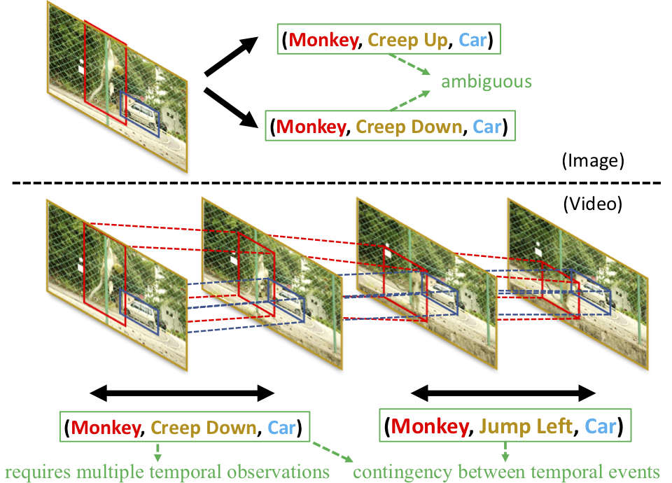
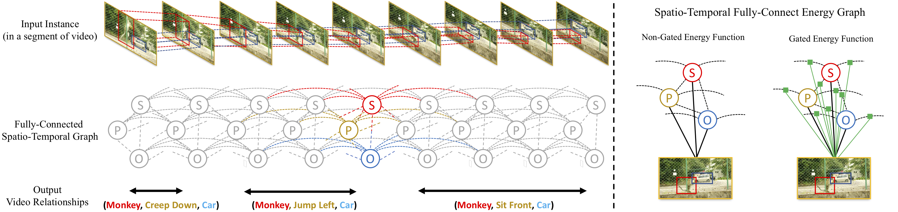

  

# Video Relationship Reasoning using Gated Spatio-Temporal Energy Graph

Pytorch implementation for learning an observation-Gated Spatio-Temporal Energy Graph for Video Relationship Reasoning on [Charades dataset](https://allenai.org/plato/charades/). 

Contact: Yao-Hung Hubert Tsai (yaohungt@cs.cmu.edu)
## Paper
Video Relationship Reasoning using Gated Spatio-Temporal Energy Graph<br>
[Yao-Hung Hubert Tsai](https://yaohungt.github.io), [Santosh Divvala](https://allenai.org/team/santoshd/), [Louis-Philippe Morency](https://www.cs.cmu.edu/~morency/), [Ruslan Salakhutdinov](https://www.cs.cmu.edu/~rsalakhu/) and [Ali Farhadi](https://homes.cs.washington.edu/~ali/)<br>
Computer Vision and Pattern Recognition (CVPR), 2019.

Please cite our paper if you find the code, dataset, or the experimental setting useful for your research.
```
@inproceedings{tsai2019GSTEG,
  title={Video Relationship Reasoning using Gated Spatio-Temporal Energy Graph},
  author={Tsai, Yao-Hung Hubert and Divvala, Santosh and Morency, Louis-Philippe and Salakhutdinov, Ruslan and Farhadi, Ali},
  booktitle={Proceedings of the IEEE Conference on Computer Vision and Pattern Recognition (CVPR)},
  year={2019}
}
```

## Overview

### Relationship Reasoning in Videos
<p align="center">

<\p>

Visual relationship reasoning in images (top) vs. videos (bottom): Given a single image, it is ambiguous whether the **monkey** is creeping up or down the **car**. Using a video not only helps to unambiguously recognize a richer set of relations, but also model temporal correlations across them (e.g., **creep down** and **jump left**).

### Gated Spatio-Temporal Energy Graph
<p align="center">

<\p>

An overview of our Proposed Gated Spatio-Temporal Energy Graph. Given an input instance (a video clip), we predict the output relationships (e.g., {**monkey, creep down, car**}, etc.,) by reasoning over a fully-connected spatio-temporal graph with nodes **S** (Subject),**P** (Predicate) and **O** (Object). Instead of assuming a non-gated (i.e., predefined or globally-learned) pairwise energy function, we explore the use of gated energy functions (i.e., conditioned on the specific visual observation).

## Usage

### Prerequisites
- Python 3.6
- [Pytorch 1.0.0 and torchvision](https://pytorch.org/)

### Datasets
- [Charades dataset](http://ai2-website.s3.amazonaws.com/data/Charades_v1_rgb.tar)
- [Charades' Training and Validation Annotations](http://ai2-website.s3.amazonaws.com/data/Charades.zip)

### Pretrained Model
- Download the [pretrained (with Kinetics Dataset) I3D](https://arxiv.org/abs/1705.07750) model [here](https://www.dropbox.com/s/r6ja11h06y2w83c/rgb_i3d_pretrained.pt?dl=0).

### Run the Code
1. Modify exp/GSTEG.py
    * Create the cache directory
    * Specify the location of the data, training/validation split, and pretrained model.
2. Command as follows
~~~~
python3 exp/GSTEG.py
~~~~

### Acknowledgement
A large portion of the code comes from the [Temporal Fields](https://github.com/gsig/temporal-fields/tree/master/pytorch) and [ImageNet](https://github.com/pytorch/examples/tree/master/imagenet) repo.
